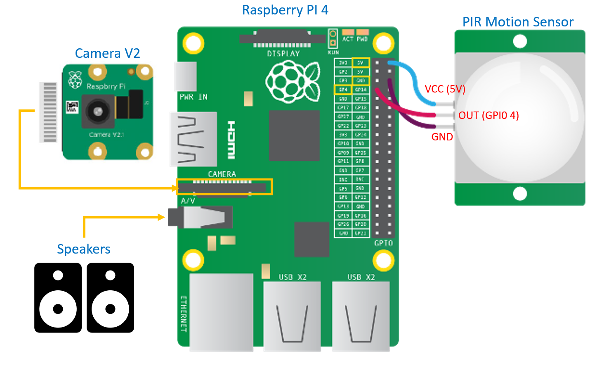

# CS 437: IOT - Smart Greetings and Security System (Final Project)

## Demo Video

You can find a demo and code walk-through video at [https://www.dropbox.com/scl/fi/p0hp766kiu69kl1p8wmuf/IOT-Project.mp4?rlkey=k8q1ywqswvbxrx8bact4c3qb4&st=zdn44a5u&dl=0]([here](https://www.dropbox.com/scl/fi/p0hp766kiu69kl1p8wmuf/IOT-Project.mp4?rlkey=k8q1ywqswvbxrx8bact4c3qb4&st=zdn44a5u&dl=0)).

Old Video Link: [https://uofi.box.com/s/qq5l0aw8imhrtn1ng0cqr4zyp5753q4w](https://uofi.box.com/s/qq5l0aw8imhrtn1ng0cqr4zyp5753q4w).


## Building the device

You'll need the following hardware to build the device:

- A Raspberry Pi 4
- A PIR Motion Sensor
- Raspberry Pi Camera Module
- Power Cables
- Speakers

You can build fancier things around those, but these are basic things you'll need. Here is the diagram for connecting
all components together:



### Device Settings

- In the pi, you'll need to enable the camera module.
- You need to set the 3.5mm headphone port as default audio port. 

## Pre-requisite Software/Services

- **Raspian Buster**: We have used raspian "Buster" as the os for our pi.
- **Mailgun**: You need to have an account at [Mailgun](https://mailgun.com) for sending the email from the application. The sandbox account will be fine for testing, but to use in large volume or for better reachability, you can verify a domain.
- **Cloud Service** *(Optional)*: You can use any cloud service for storing the files for longer period of times. We have used Google Cloud, but any would do.

## Setup and Execution

### Initial Setup

First, clone this repository in both the pi and your vm or local machine in the same wifi network as the pi. (For ease of understanding, we will refer to the *pi* as **pi** and the *local machine* as the **vm**)

```bash
git clone https://github.com/samhq/cs437iot-final
cd cs437iot-final
```

In the pi, run

```bash
cd pi
./setup.sh
```

In the vm, run the following comand

```bash
cd cloud
./setup.sh
```

### Application Setup in VM

Inside the vm, in the `cloud/backend` directory, you need to create the environment variable file.

```bash
cp .env.example .env
```

Open the `.env` file and add your URL/IP_ADDRESS:PORT for the cloud/backend server like the following:

```bash
BASE_URL="http://VM_IP_ADDRESS:5000"
```

After that you can run it using `flask run --host=0.0.0.0`

In another console to the vm, go to the `cloud/frontend` directory and run `python3 simple_cors_server.py`. It will start the server for the management console, which can be accessed at [http://VM_IP_ADDRESS:8000](http://VM_IP_ADDRESS:8000).

### Application Setup in Pi

Inside the pi, go to the `pi` directory, then create the required environment file:

```bash
cp .env.example .env
```

The file contents are as follows:

```bash
SERVER_URL="http://VM_IP_ADDRESS:5000"      # Set the ip address or url of vm api server                 
MAILGUN_URL="smtp.mailgun.org"              # like "https://api.mailgun.net/v3/YOUR_DOMAIN_NAME/messages"
MAILGUN_API_KEY="MAILGUN_API_KEY"           # get from the mailgun
SENDER_EMAIL="no-reply@thesamiul.com"
DEFAULT_TO_EMAILS="A_DEFAULT_EMAIL"
```

Note: Initially, the encoding file and the settings file will be missing. But you'll get that in next step.

In a console window, run `python3 api_server.py`. It will boot up the server for backend communication with the vm.

In another console window, run `python3 video_streaming_server.py` which will be used to stream the live feed. You don't need to run the `detector_server.py`. This detector service and the video streaming service will start and stop alternatively according to the motion sensing.

### Update Settings

In the management console at [http://VM_IP_ADDRESS:8000](http://VM_IP_ADDRESS:8000), 

- Add a new device. Give it a name (anything you like), an **id** (must be only characters, no spaces, no special characters), the URL/IP:PORT of the Pi api server (like `https://IP_OF_PI:5000`) and the live stream server (like `https://IP_OF_PI:8000`).
- Go to *Manage Device* > *Settings*. In the JSON, set the `deviceId` with the **id** you used when adding that device.
- You can add/update emails here to send the notifications. If you don't set anything here, the email will be sent to the default email address defined in the `.env` file (if you set that).

**Now, the application will continue running and start greet people, save their photos and send you email.**.

## Train

After you have a bunch of images in the vm (you can visit the history page in the management console), you can start rename them with people name that are known to you. WHen you finish editing, go to the *Settings* page and click **Train Again**. It will create a model encoding file from the saved images, and push this file to the pi. 

From that time forward, before greeting, new people image will be matched first. If any match found, greetings and notification will changed. The system will keep saving and uploading the pictures of both known and unknown peoples to the vm.

## View Live Feed

If you go to the *Manage Device* > *Live Feed* link, you can view the live stream from the camera. One thing to note is when the pi is in the process of detecting and processing the image recognition, live video will be unavailable for a short period of time.

## Team Members

- Ayush Khanna (<akhanna6@illinois.edu>)
- Gazi Muhammad Samiul Hoque (<ghoque2@illinois.edu>)
- Jennifer Tsai (<jtsai21@illinois.edu>)
- Yunhan Guo (<yunhang2@illinois.edu>)
